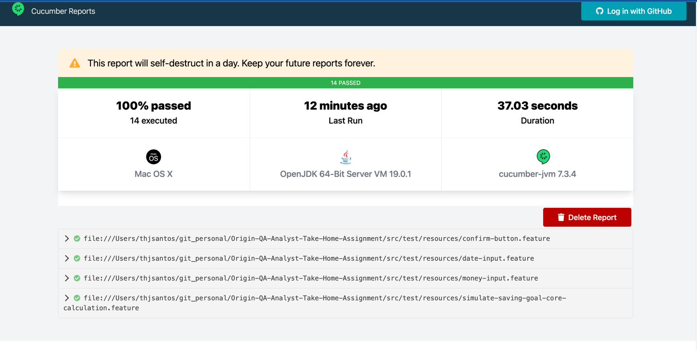
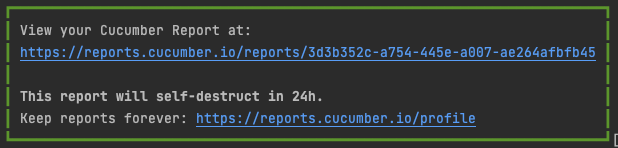

# Test Plan for Origin Savings Plan Simulation Screen

## Introduction:
The objective of this test plan is to ensure that the savings plan simulation screen is functioning as expected, meeting all the requirements specified in the assets section.

## Scope:
This test plan will cover the following components of the savings plan simulation screen:
- Money input
- Date input
- Confirm button

## Assumptions:
- The users have a basic understanding of how to use a web application.
- The users have access to a computer or mobile device with an internet connection.
- The users are familiar with the concept of saving towards a goal.

## Main Test Cases:

### Calculation validation:
#### Objective:
To ensure that the calculation is correct independently on chosen year, month and value.
#### Test Steps:
1. Enter a numeric on total amount and select a month and year
2. Monthly amount should be: TotalAmount/NumberOfMonthsUntilSelectedReachedDate

Test automation coverage: [simulate-saving-goal-core-calculation.feature](src/test/resources/simulate-saving-goal-core-calculation.feature)

### Money input validation:
#### Objective:
To ensure that the money input field accepts only numbers and formats the entered value as money.
#### Test Steps:
1. Enter a non-numeric value in the money input field and verify that the field doesn't accept it.
2. Enter a valid number in the money input field and verify that the value is formatted as money (e.g 3500.45 should be 3,500.44).

Test automation coverage: [money-input.feature](src/test/resources/money-input.feature)

### Date input validation:
#### Objective:
To ensure that the date input field accepts only future months and can be navigated using arrow keys.
#### Test Steps:
1. Enter a past month in the date input field and verify that the field doesn't accept it.
2. Enter a future month in the date input field and verify that the field accepts it.
3. Click on the arrow buttons to navigate through the months and verify that the field updates accordingly.
4. Focus on the date input field and verify that the users can move the months by typing the Left and Right arrow keys on the keyboard.

Test automation coverage: [date-input.feature](src/test/resources/date-input.feature)

### Confirm button functionality:
#### Objective:
To ensure that the confirmation button is displayed and functional.
#### Test Steps:
1. Verify that the confirmation button is displayed on the screen.
2. Click on the confirmation button and verify that it doesn't have any action.

Test automation coverage: [money-input.feature](src/test/resources/money-input.feature)

## Test Coverage:

In a real scenario, most of the calculation tests would be done on unit test level instead of UI testing. Also, to respect the test pyramid, I have verified that no endpoint is called; otherwise, I would cover the API called by the frontend with tests. The Figma link has been verified so color hex code, font style, and alignment are matching the page implementation.

## Automated Test Script:

Please access the README file with the instructions on how to execute it
[README.md](README.md)

## Test Report:

Example of test report execution:

When executing,a fresh new report is provided:

